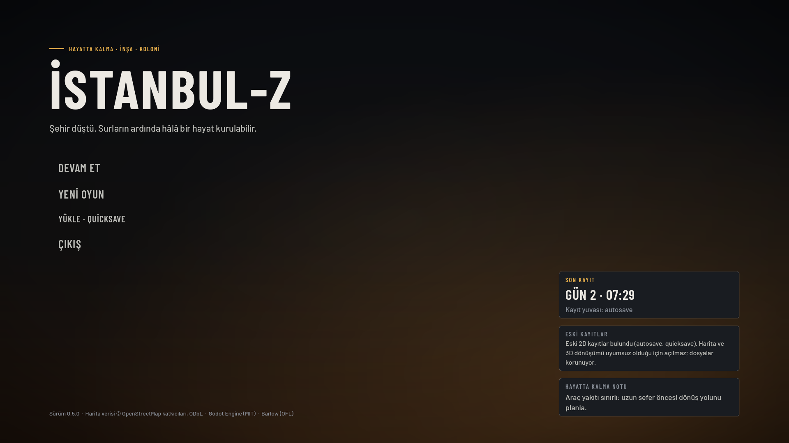
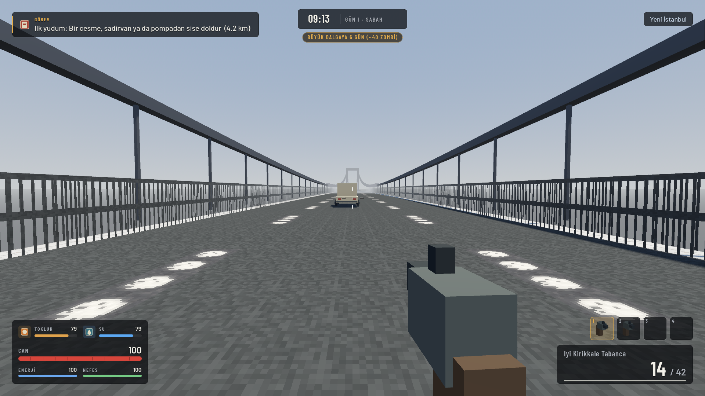
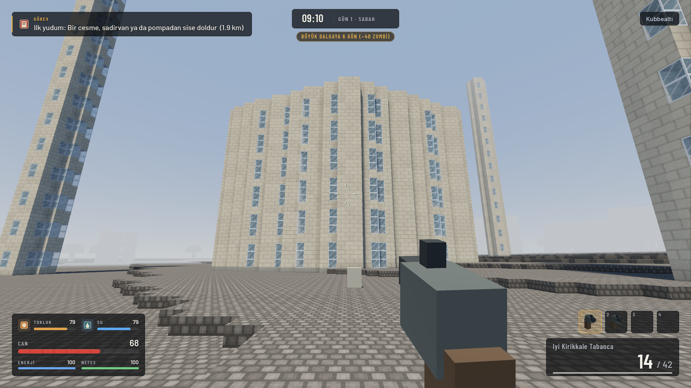
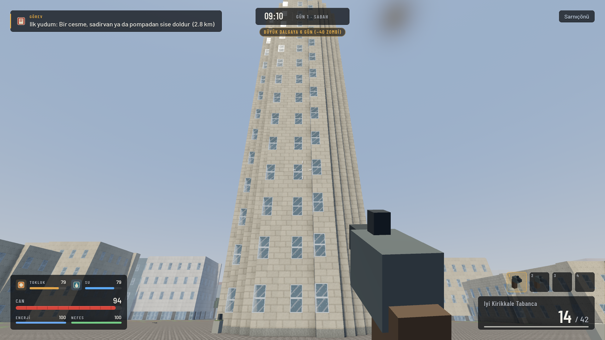
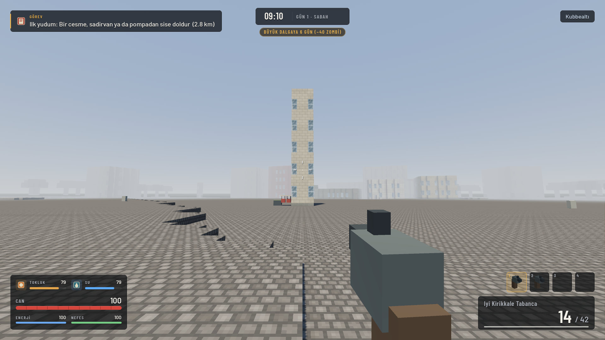
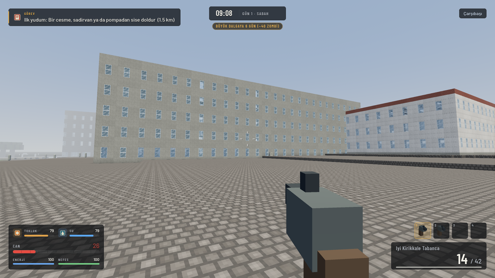
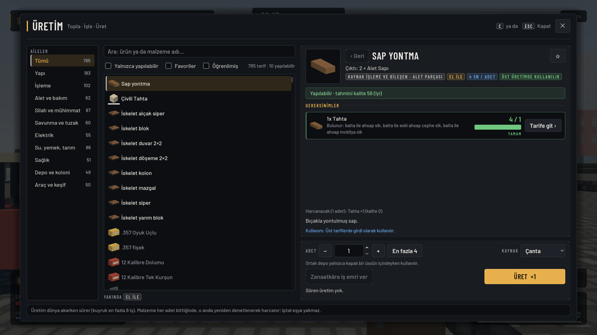
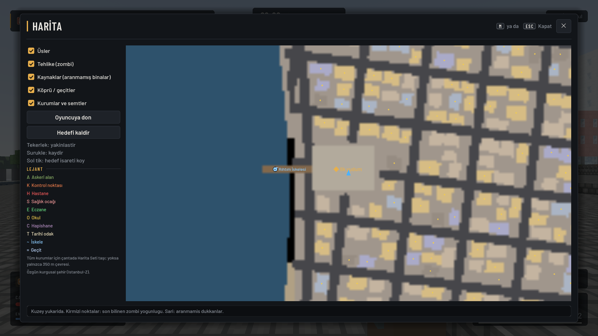
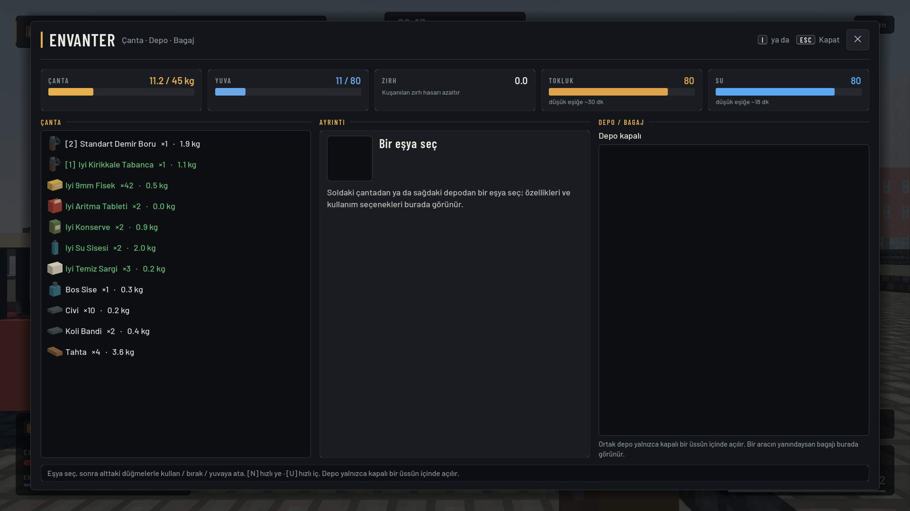
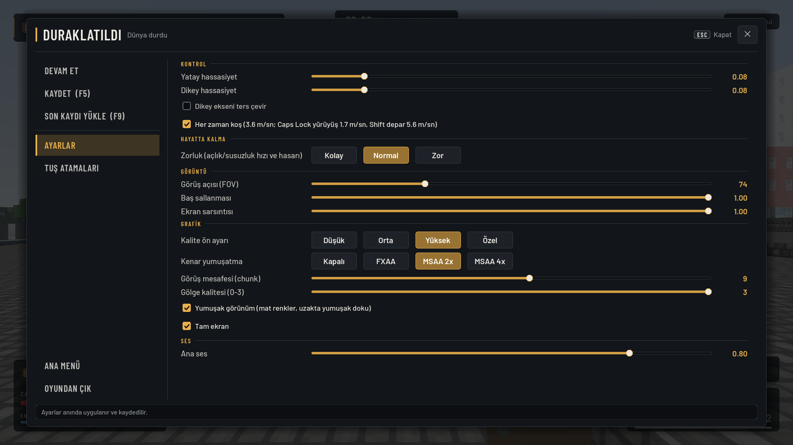

<div align="center">

# İSTANBUL-Z

**Voxel zombi hayatta kalma · inşa · koloni**

*Şehir düştü. Surların ardında hâlâ bir hayat kurulabilir.*




</div>

---

İstanbul-Z, İstanbul'un tarihî dokusundan ilham alan **kurgusal, 10 × 10 km'lik sabit bir şehirde** geçen birinci şahıs bir zombi hayatta kalma oyunudur. Her blok kırılabilir; her binaya kapısından girilir ve bütün katlarına merdivenle çıkılır. Kaynak topla, işle, üret, üssünü güçlendir ve her yedinci gecenin büyük dalgasından sağ çık.

## Ekran görüntüleri

| | |
|:---:|:---:|
|  |  |
| **Martı Köprüsü:** boğazın iki yakasını bağlayan asma köprü | **Kubbealtı:** tarihî yarımadada Büyük Kubbe ve minareleri |
|  |  |
| **Martı Kulesi:** Sarnıçönü'nün en yüksek gözetleme noktası | **Sultan Meydanı:** dikilitaş ve çeşmeler |
|  |  |
| **Çarşıbaşı Hastanesi:** tıbbi loot, yüksek risk | **Üretim (C):** 785 tarif, 10 aile, 12 istasyon |
|  |  |
| **Harita (M):** kurumlar, semtler, görev hedefleri | **Envanter (I):** ağırlık, yuva, tokluk ve su |

<p align="center"><br><b>Ayarlar:</b> Düşük / Orta / Yüksek, kenar yumuşatma, yumuşak görünüm, tuş atamaları</p>

## Öne çıkanlar

### 🏙️ Yeni İstanbul: 100 km² sabit kurgusal şehir
- **24 özgün semt:** Rıhtım, Çarşıbaşı, Kubbealtı, Surdibi, Saraykapı, Martıköy, Kalebend…
- **Boğaz ve haliç:** 20 km² su ve 59 bin bina. Tarihî merkez, konut, ticaret, sanayi, kampüs ve yeşil çeper ayrı dokularda.
- **Kurumlar:** 3 askerî alan, 8 kontrol noktası, 4 hastane, 8 sağlık ocağı, 24 eczane, 12 okul, 2 hapishane.
- **8 tarihî odak:** kule, kubbe, saray avlusu, sarnıç, Kara Surları, Kapalı Han, kıyı konağı ve meydan.
- **Kuruma özgü ganimet:** okulda kitap ve alet, hastanede ilaç, askerî alanda mühimmat, hapishanede metal ve atölye malzemesi.
- **Tek bir geçide sıkışmazsın:** asma köprü, alçak geçitler ve kara yolu var.

### 🧟 Yaşayan, kalıcı bir zombi nüfusu
- **Yoğunluk semte göre değişir:** merkezde km² başına ~360, konutta ~170, çeperde ~40 zombi. Hastane, askerî alan ve hapishanenin kendi kalabalığı ve zombi karışımı var.
- **Temizlediğin bölge temiz kalır:** öldürdüğün zombi geri doğmaz, bölge günde yalnızca %5 dolar.
- **Silah sesi sürüyü çeker:** yakındakiler tam yapay zekâ ile avlanır. Uzaktakiler silüet olarak görünür ve sese doğru yürür.

### 🔧 Topla → İşle → Üret → Güçlendir
- **785 tarif:** yapı, işleme, alet, silah, savunma, elektrik, gıda, sağlık, depolama, araç ve keşif. Her ürünün oyunda gerçek bir işlevi var.
- **Kaynak toplama:** balta, kazma ve anahtarla. Haritanın kendi blokları kaynak verir, üretim sömürüsü yok.
- **İnşa:** inşa kipi (B), malzeme kademeleri (tahta → tuğla → beton → çelik), yükseltme, onarım, söküm ve kapılar.
- **Elektrik:** jeneratör (yakıt ve gürültü), güneş ve rüzgâr, akü, kablo direği, şalter, sensör, lamba, tuzak ve taret.
- **Hayatta kalma:** tarım, su arıtma, pişirme ve bozulma, koloni sakinleri ve iş emirleri.

### 🎨 Yumuşak, mat voxel görünüm
- **Görünüm:** pixel-art dokular, yumuşak gölge, sokak yankılı sesler.
- **Performans:** 1080p'de Orta ayarda bütün test sahnelerinde 60 FPS'in üzerinde. 80 zombi saldırısında en kötü kare süresi (p99) 27 ms; ölçüm RTX 3050 Laptop'ta yapıldı.

## Kontroller

| Tuş | İşlev | Tuş | İşlev |
|---|---|---|---|
| WASD · Shift · Space | hareket · depar · zıpla | E | ara / al / kullan |
| Sol / sağ tık | ateş · nişan | R | doldur |
| I | envanter | C | üretim |
| B | inşa kipi | L | koloni / üs |
| M | harita | K | beceri ağacı |
| J | görev günlüğü | N / U | hızlı ye / iç |
| T / Y | fırlat / fırlatılacak olanı değiştir | O | dürbün |
| F5 / F9 | hızlı kaydet / yükle | Esc | duraklat · ayarlar |

Bütün tuşlar Esc → Tuş atamaları'ndan değiştirilebilir.

## Çalıştırma

Gereken: [Godot 4.7.2](https://godotengine.org) (standart sürüm, .NET gerekmez).

```powershell
# Editörsüz çalıştır (Godot yolu fps/tools/godot.ps1 içinde)
powershell -ExecutionPolicy Bypass -File fps\tools\godot.ps1 run

# Ya da Godot editöründe fps/project.godot dosyasını açıp F5

# Testler (başsız, ~3 dk)
powershell -ExecutionPolicy Bypass -File fps\tools\godot.ps1 tests

# Windows EXE paketi + duman testi
powershell -ExecutionPolicy Bypass -File fps\tools\export.ps1
```

Ayrıntılı geliştirici belgesi: [`fps/README.md`](fps/README.md) · teslim ve ölçüm raporu: [`fps/docs/reports/TESLIM_RAPORU.md`](fps/docs/reports/TESLIM_RAPORU.md) · mimari: [`fps/docs/MIMARI.md`](fps/docs/MIMARI.md)

## Proje yapısı

```
fps/
├── src/            GDScript: dünya, voxel, yapay zekâ, savaş, üretim, üs, arayüz
├── data/           Bütün içerik JSON'dur: eşya, tarif, silah, zombi, görev, harita
├── assets/         Modeller (GLB), ikonlar, Barlow yazı tipi, ses paketi
├── tests/          145 otomatik test (gerçek oyun sahnesi dahil)
└── tools/          Geliştirme araçları: şehir üretici, içerik üretici, ses üretici
```

İçerik veridir: oyun açılışta bütün JSON'ları şemaya göre doğrular. Hata varsa oyun açılmaz ve hatayı listeler. Şehir ve 700'den fazla tarif, geliştirme araçlarıyla bir kez üretilip dosyada sabitlenir; oyun açılışta rastgele bir şey üretmez.

## Lisanslar ve teşekkür

- Motor: [Godot Engine](https://godotengine.org) (MIT)
- Yazı tipi: [Barlow](https://github.com/jpt/barlow) (SIL OFL 1.1, `fps/assets/fonts/OFL.txt`)
- Eski gerçek İstanbul haritaları (Maltepe–Beşiktaş koridoru, Kadıköy): © OpenStreetMap katkıcıları, ODbL. Varsayılan "Yeni İstanbul" şehri özgün tasarımdır ve gerçek harita verisi içermez.
